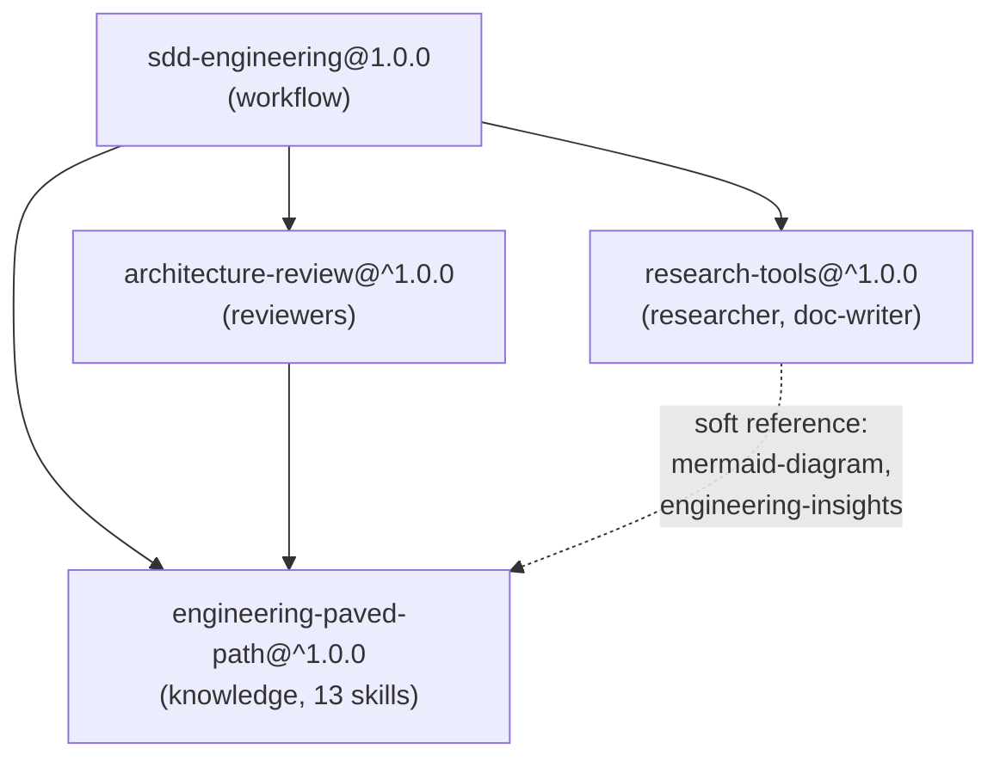

# fk-dev-digest-marketplace

A Claude Code plugin marketplace: a complete spec-driven development (SDD) workflow, the
technical knowledge it depends on, an architecture reviewer, and research tools — split into four
independently versioned plugins that install together through declared dependencies.

## Install

Add the marketplace, then install the plugin you want:

```
/plugin marketplace add felkost/fk-dev-digest-marketplace
/plugin install sdd-engineering@fk-dev-digest-marketplace
```

Installing `sdd-engineering` pulls in its three dependencies automatically — the installer shows
the full plan before you confirm:

```
sdd-engineering@1.0.0
├── engineering-paved-path@^1.0.0
├── research-tools@^1.0.0
└── architecture-review@^1.0.0
    └── engineering-paved-path@^1.0.0  # one shared installation
```

You can also install any plugin standalone — `engineering-paved-path` and `research-tools` have
no dependencies; `architecture-review` depends only on `engineering-paved-path`.

To make the marketplace available to your whole team automatically, add it to your project's
`.claude/settings.json`:

```json
{
  "extraKnownMarketplaces": {
    "fk-dev-digest-marketplace": {
      "source": { "source": "github", "repo": "felkost/fk-dev-digest-marketplace" }
    }
  },
  "enabledPlugins": {
    "sdd-engineering@fk-dev-digest-marketplace": true
  }
}
```

## What's in the catalog

| Plugin | What it provides | Depends on |
|---|---|---|
| [`engineering-paved-path`](plugins/engineering-paved-path/README.md) | 13 knowledge skills for the TypeScript stack — architecture, Fastify, Drizzle, Postgres, React, Next.js, testing, security, Mermaid | — |
| [`research-tools`](plugins/research-tools/README.md) | Read-only researcher agent, doc-writer agent + skill, dependency-checker skill | — |
| [`architecture-review`](plugins/architecture-review/README.md) | Two read-only architecture reviewers that ground findings in your own repo's documented rules | `engineering-paved-path` |
| [`sdd-engineering`](plugins/sdd-engineering/README.md) | The full spec → plan → implement → verify → retro pipeline: 5 agents, 5 skills, 1 command, 1 hook | `engineering-paved-path`, `research-tools`, `architecture-review` |

## Dependency graph



Knowledge is separated from workflow: `engineering-paved-path` is the single source of truth for
technical skills, referenced by namespaced name (`engineering-paved-path:<skill>`) from the other
three plugins rather than copied into each one. `research-tools`' soft references (dashed) are not
declared `dependencies` — they degrade gracefully when the other plugin isn't installed, so
`research-tools` stays usable entirely on its own. See `docs/RELEASES.md` for what a version bump
in one plugin does and does not do to the others.

## Scaffolding a new plugin

This marketplace launched with **four plugins** — the minimal split that separates knowledge from
workflow from review without duplicating anything (see the graph above). To add a fifth:

1. Create `plugins/<name>/.claude-plugin/plugin.json` (or run `claude plugin init` inside
   `plugins/<name>/` and adjust the result to match this repo's conventions).
2. Add `skills/`, `agents/`, `commands/`, or `hooks/` at the plugin root — never inside
   `.claude-plugin/` (see `docs/PLUGIN-GUIDELINES.md`).
3. Write `README.md`, `CHANGELOG.md`, `COMPATIBILITY.md` — every plugin here has all three.
4. Add one entry to `.claude-plugin/marketplace.json` (`name`, `source: "./plugins/<name>"`, plus
   `description`/`category`/`keywords`).
5. If it reuses technical knowledge, depend on `engineering-paved-path` rather than duplicating a
   skill — see `docs/PLUGIN-GUIDELINES.md` § single source of truth.
6. Run `node scripts/validate-marketplace.mjs` and `claude plugin validate .` before opening a PR.

Full requirements: `docs/PLUGIN-GUIDELINES.md`. Contribution process: `CONTRIBUTING.md`.

## Optional integrations (not installed by default)

Two capabilities from the source project were deliberately **not** carried into this marketplace's
first release, because they need network access or credentials this repository doesn't manage:

- **An MCP server** for product-specific integrations — not part of any plugin here; add your own
  via a project-level `.mcp.json` if you need one.
- **OpenRouter-backed evals** (`evals/`'s `EVAL_BACKEND=openrouter` runtime) — the eval framework
  supports it, but running it requires your own `OPENROUTER_API_KEY`; the default runtime uses
  your Claude Code subscription with no external service.

## Governance

- [`CONTRIBUTING.md`](CONTRIBUTING.md) — how to propose a change, naming rules, pre-release checks, PR checklist
- [`docs/PLUGIN-GUIDELINES.md`](docs/PLUGIN-GUIDELINES.md) — naming, canonical structure, manifest fields, cross-plugin references
- [`docs/SECURITY.md`](docs/SECURITY.md) — permissions model, secrets policy, incident response
- [`docs/RELEASES.md`](docs/RELEASES.md) — SemVer, tagging, `scripts/release.mjs` / `scripts/rollback.mjs`
- [`docs/SITE-SPEC.md`](docs/SITE-SPEC.md) — spec for the in-repo catalog website: data pipeline, `catalog.json` shape, views, search, build & deploy
- [`site/README.md`](site/README.md) — the browsable catalog website (`site/`): how to build `catalog.json` and deploy to GitHub Pages or Render
- [`server/README.md`](server/README.md) — the optional usage-stats backend (`server/`): Fastify + Drizzle + Neon on Render
- [`CODEOWNERS`](CODEOWNERS) — who reviews and releases what

## Provenance

These plugins were extracted from the `.claude/` harness of the [DevDigest](https://github.com/felkost/dev-digest)
project (a PR-review tool), generalized to work in any repository. No changes were made to that
source project as part of this extraction.
