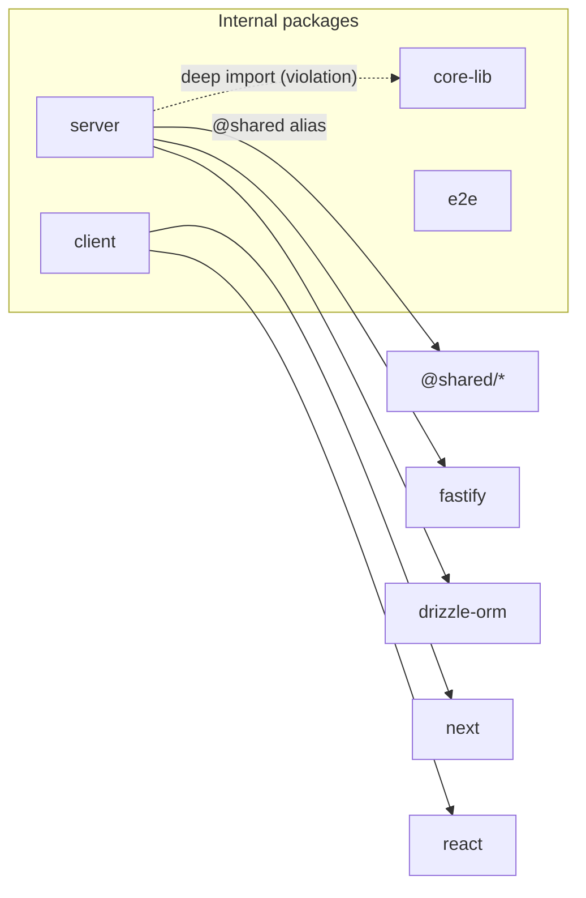
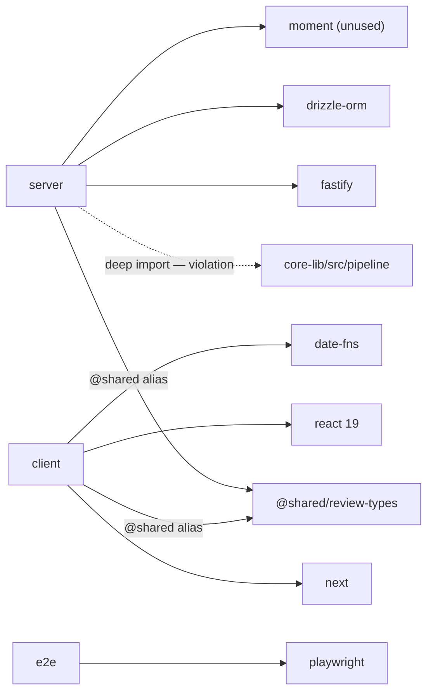

# Report Template

Copy this skeleton verbatim and fill each section. Keep the section names and order. A worked
example follows the blank skeleton — use it as the quality bar for tone and specificity.

---

## Blank skeleton

```markdown
# Dependency Report — <repo or scope>

## Scope
Packages analyzed: `<pkg-a>`, `<pkg-b>`, ….
Linkage model: <workspaces | TypeScript path aliases and relative imports> — as detected in Step 1.
Sources: <N> package.json files, `du -sh` on node_modules, import grep across each package's `src`.

## Dependency Graph


## Size Breakdown
| Package | Dependency | Type | Installed size | Note |
|---|---|---|---:|---|
| client | next | dep | 132M | framework, expected |
| server | drizzle-orm | dep | 8.1M | |
| server | moment | dep | 4.2M | unused (see P2) |
_Per-package total: server ≈ X · client ≈ Y · …_

## Findings & Priorities
### P0 — fix first
- **<pkg/dep>** — <what> (`<file>`). <why>.

### P1 — cost / drift
- **<pkg/dep>** — <what> (`<file>`). <why>.

### P2 — cleanup
- **<pkg/dep>** — <what> (`<file>`). <why>.

### Info
- <context line, no action required>.

## Summary
1. **[P0]** <package> — <concrete next step>.
2. **[P1]** <package> — <concrete next step>.
3. **[P2]** <package> — <concrete next step>.
```

---

## Worked example (quality bar)

## Scope
Packages analyzed: `server`, `client`, `core-lib`, `e2e`. This repo is **not** a workspace
monorepo — code is shared through TypeScript path aliases (`@shared/*`) and relative imports
(detected: no `workspaces` field, no `pnpm-workspace.yaml`).

## Dependency Graph


## Size Breakdown
| Package | Dependency | Type | Installed size | Note |
|---|---|---|---:|---|
| e2e | playwright | dev | 210M | test-only, not shipped |
| client | next | dep | 132M | framework |
| client | date-fns | dep | 22M | overlaps `moment` capability |
| server | drizzle-orm | dep | 8.1M | |
| server | fastify | dep | 6.5M | |
| server | moment | dep | 4.2M | **unused** — no import under `server/src` |

## Findings & Priorities
### P0 — fix first
- **server → core-lib** — `server/src/services/review-service.ts` imports
  `core-lib/src/pipeline.js` by relative path, bypassing the package's public entry point. This
  couples server to core-lib internals and breaks the side-effect-free boundary.

### P1 — cost / drift
- **zod** — three resolved versions across packages: `3.23.8` (server, core-lib) vs `3.22.4`
  (client). Align on one version to avoid duplicate installs and type-mismatch surprises.

### P2 — cleanup
- **moment** — declared in `server/package.json` but never imported under `server/src`. Candidate for
  removal; `date-fns` already covers date handling on the client.

### Info
- Heaviest footprint is `e2e/playwright` (210M) and `client/next` (132M) — both expected for their role.

## Summary
1. **[P0]** `server/src/services/review-service.ts` — import `core-lib` through its public entry, not `src/pipeline.js`.
2. **[P1]** `zod` — pick one version (suggest `3.23.8`) across `server`, `client`, `core-lib` package.json.
3. **[P2]** `moment` — after confirming no runtime use, remove it from `server/package.json`.
